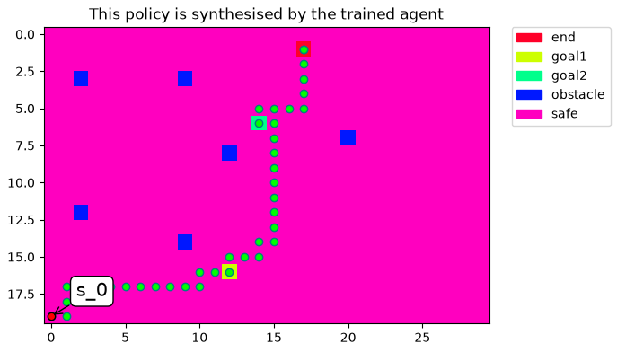

# LTLtoProductMDP

Braeden Treutel **(@braeden512)**

This repository is a practical extension of LCRL (Logically-Constrained Reinforcement Learning) workflows for training policies under LTL specifications.
It keeps the original LCRL core idea: an on-the-fly product MDP is explored during learning rather than precomputing the full product.

## Upstream/original repository

Original LCRL repository: **https://github.com/grockious/lcrl** and associated paper: https://arxiv.org/pdf/2209.10341

## Setup

1. Create and activate a Python virtual environment.
2. Install this repository in editable mode:

```bash
pip install -e .
```

3. Install OWL and verify it is available:

```bash
owl --help
```

If OWL is not on `PATH`, pass `owl_binary="/path/to/owl"` to `train(...)`, or set `LCRL_OWL_BINARY`.

## Run

```bash
python training_script.py
```

Artifacts are saved under:

`/results/<dated file name>`

including convergence plots and test-policy outputs (also animation if approved during training run).

## Minimal direct invocation example

```bash
MPLBACKEND=Agg PYTHONPATH=src python - <<'PY'
from lcrl.train import train
from lcrl.environments.ordered_goal_grid import OrderedGoalGrid

train(
    OrderedGoalGrid(),
    'G(!obstacle) & F(goal1 & F(goal2 & F(end)))',
    algorithm='ql',
    episode_num=20000,
    iteration_num_max=4000,
    discount_factor=0.95,
    learning_rate=0.9,
    epsilon=0.0,
    test=True,
)
PY
```



Note: Training currently doesn't optimize for shortest path, just for satisfying LTL specification. Look into this in the future (as well as multi-agent capabilities)

## What changed here compared to LCRL

### 1) New custom environment for ordered-goal task

**File:** `src/lcrl/environments/ordered_goal_grid.py`

This repository adds `OrderedGoalGrid`, a deterministic 20x30 gridworld with:

- fixed start state
- ordered intermediate goals (`goal1`, then `goal2`)
- final terminal state (`end`) that only counts after goals are reached in order
- terminal obstacle states (`obstacle`)
- no stochastic slip like in slipperygrid (`slip_probability=0.0`)

The environment tracks task progress internally (`reached_goal_1`, `reached_goal_2`, `done`, `termination_reason`) and exposes labels used by the automaton update logic.

### 2) LTL-string to LDBA translation path using OWL

**File:** `src/lcrl/ltl.py`

This project includes an explicit LTL translation flow where:

1. string LTL formulas are translated with OWL (`owl ltl2ldba -f ...`)
   - OWL repo found here: https://github.com/owl-toolkit/owl/releases/tag/release-21.0
   - test output in command line like this: `owl ltl2ldba -f 'enter ltl formula here'`
2. HOA output is parsed into a runtime `LDBA` object (`hoa_to_ldba`)
3. guard expressions are parsed/evaluated with internal parser/evaluator logic
4. automaton transitions are synchronized with environment labels during training/testing

### 3) Training entrypoint configured for this experiment

**File:** `training_script.py`

The script runs `train(...)` with:

- `OrderedGoalGrid()`
- formula: `G(!obstacle) & F(goal1 & F(goal2 & F(end)))`
- algorithm: Q-learning (`algorithm='ql'`)
- long horizon training defaults (`episode_num=20000`, `iteration_num_max=4000`)

This script is the main reproducible starting point.

### 4) Train function integration for string formulas

**File:** `src/lcrl/train.py`

`train(...)` now supports either:

- an already-built LDBA object, or
- an LTL formula string (auto-converted through `ltl_to_ldba(...)`)

This keeps call sites simple for new experiments while retaining compatibility with existing LCRL-style usage.

## Key files

| File                                         | Why it matters                                                                                             |
| -------------------------------------------- | ---------------------------------------------------------------------------------------------------------- |
| `training_script.py`                         | Fastest way to run the current experiment end-to-end.                                                      |
| `src/lcrl/environments/ordered_goal_grid.py` | Defines state space, labels, transitions, and termination semantics of the custom task.                    |
| `src/lcrl/ltl.py`                            | Defines the OWL -> HOA -> runtime LDBA pipeline; critical for changing LTL formulas or automaton behavior. |
| `src/lcrl/train.py`                          | Main training/testing orchestration and result artifact creation.                                          |
| `src/lcrl/core/lcrl_core.py`                 | Core product-MDP learning logic inherited from/compatible with LCRL internals.                             |

## Current experiment specification

The active task formula in `training_script.py` is:

`G(!obstacle) & F(goal1 & F(goal2 & F(end)))`

Interpretation:

- always avoid obstacle-labeled states
- eventually reach `goal1`
- then eventually reach `goal2`
- then eventually reach `end`

This encodes sequential task completion under safety constraints.
